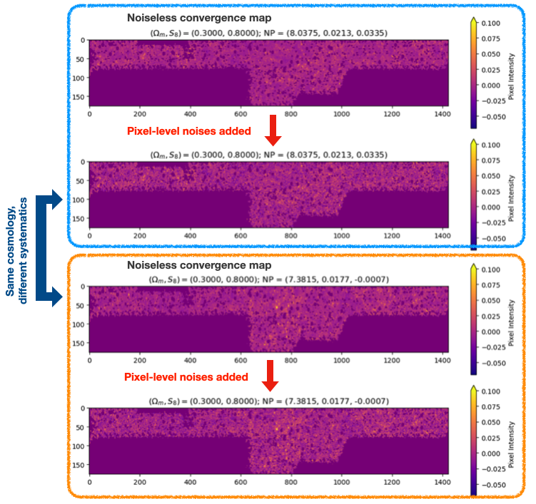
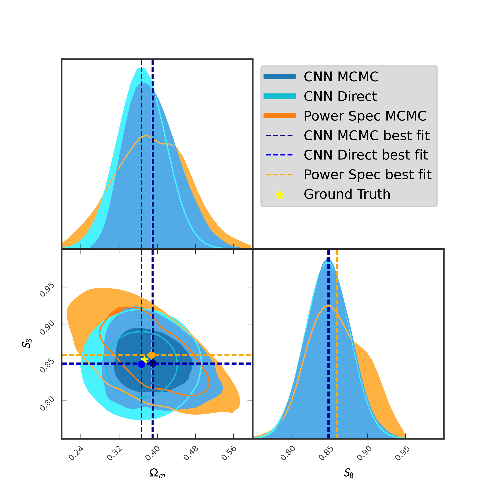

# Data
***

## Dataset
Participants will work with simulated datasets mimicking observations from the [<ins>Hyper Suprime-Cam (HSC) survey</ins>](https://science.jpl.nasa.gov/projects/hyper-suprime-cam/). Each data is a 2D image of dimension $1424 \times 176$, corresponds to the convergence map of redshift BIN 2 of WIDE12H subfield in HSC Y3, pixelized with a resolution of 2 arcmin. 

These weak lensing convergence maps are generated from high-resolution cosmological ray-tracing simulations with $101$ different spatially-flat $\Lambda \text{CDM}$ cosmological models. Each cosmological model differs in cosmological parameters $\Omega_m$, the fraction of the total matter density of the Universe, and $S_8$, the amplitude of matter fluctuations on $8 \,\mathrm{Mpc}/h$ scales in the Universe today. These two parameters serve as the label of each data. 

In addition to the cosmological signal, we also model various realistic systematic effects (distortions to the data), such as baryonic effect and photometric redshift uncertainty. These systematics are introduced in the data generation process, which we fully sampled in the training set so that the participants can marginalize over them. The parameters corresponding to these systematic models are nuisance parameters and need to be marginalized during inference.

<!-- We have prepared the training data and the Phase 2 test data for participants. Please download them from
[**<ins>Training Data / Phase 2 Test Data (6.7 GB)</ins>**](https://www.codabench.org/datasets/download/c99c803a-450a-4e51-b5dc-133686258428/).  -->

The figure below shows some examples of the training data and how they are varied with different nuisance parameters and pixel-level noise.

 

The Phase 2 training data and test data will be available when the Phase 2 starts.

## Baseline Methods
<!-- - ### Phase 1: Cosmological Parameter Estimation

    1. **Power Spectrum Analysis** 

        In cosmology, the power spectrum describes how matter is distributed across different size scales in the universe and is a key tool for studying the growth of cosmic structure. Starting from the matter density $\delta(x)$, we transform it into Fourier space to get $\tilde{\delta}(x)$, which represents fluctuations as waves of different wavelengths. The matter power spectrum P(k) is then defined by:

        $$\langle \tilde{\delta}(\mathbf{k}) \tilde{\delta}^*(\mathbf{k}') \rangle = (2\pi)^3 \delta_D(\mathbf{k}-\mathbf{k}') P(k),$$

        where k is the wavenumber corresponding to a scale $\lambda \sim 1/k$, and $ \delta_D$ is the Dirac delta function. Intuitively, P(k) tells us how "clumpy" the universe is on different scales. In cosmology, the shape and amplitude of P(k) encodes the physics and composition of the universe, making it one of the most important statistical tools in the field.

        In this baseline method, we use power spectrum as the summary statistic to constrain the cosmological parameters, so
        $$
        \boldsymbol{d} = \text{log} ~P(k)~~\text{ with $n_d=$ number of bins in wavenumber } k.
        $$

    2. **Convolutional Neural Network + MCMC**

        In this notebook, we use the outputs of the convolutional neural network (the point estimates of cosmological parameters $\boldsymbol{\theta} = (\hat{\Omega}_m, \hat{S}_8)$) as the summary statistic to constrain the cosmological parameters, so
        $$
        \boldsymbol{d} = f_{\rm NN}^{\phi} ~~\text{ with $n_d = 2$.}
        $$

        The model is trained with an MSE loss.

    3. **Convolutional Neural Network Direct Prediction**

        In this notebook, we do not fit any predefined summary statistics to the data and perform MCMC. Instead, we estimate the uncertainties directly using the CNN. This is achieved by optimizing a KL divergence objective function using neural network predictions during training. For each 2D map, the CNN will predict its cosmological parameters $(\hat{\Omega}_m, \hat{S}_8)$ and the standard deviations of the joint Gaussian posterior distribution $(\hat{\sigma}_{\Omega_m}, \hat{\sigma}_{S_8})$.

        The model is trained with a KL divergence objective function defined by
        $$
        \text{KL Loss}= \frac{1}{N} \sum_i^{N}\left\{\frac{\left(\hat{\Omega}_{m, i}-\Omega_{m, i}^{\text {truth }}\right)^2}{\hat{\sigma}_{\Omega_m, i}^2}+\frac{\left(\hat{S}_{8, i}-S_{8, i}^{\text {truth }}\right)^2}{\hat{\sigma}_{S_8, i}^2}+\log \left(\hat{\sigma}_{\Omega_m, i}^2\right)+\log \left(\hat{\sigma}_{S_8, i}^2\right)\right\}~.
        $$

    The plot below shows a comparison between the sampled posterior distributions of our three baseline methods. Comparing to the traditional power spectrum analysis, the neural networks can capture more information from the weak lensing data, leading to better predictions. 
    

     
    

    You can also find visualizations about the dataset and the Phase 1 baseline methods in the `Starting Kit` tab. -->

- ### Phase 2: Out-of-Distribution Detection

    1. **Chi-squared distributions from the Phase-1 baseline methods**

        With the baseline MCMC methods of Phase 1, we assess the goodness-of-fit of the test sample $i$ using the $\chi^2$ statistic
        $$
            \chi_i^2 = [\boldsymbol{d}_i-\mu(\hat{\boldsymbol{\Theta}}_i)]^T {\rm Cov}^{-1}(\hat{\boldsymbol{\Theta}}_i)[\boldsymbol{d}_i-\mu(\hat{\boldsymbol{\Theta}}_i)]~,    
        $$
        where $\mu(\hat{\boldsymbol{\Theta}}_i)$ and ${\rm Cov}(\hat{\boldsymbol{\Theta}_i})$ are the mean and covariance matrix of the summary statistics estimated at the best-fit parameters $\hat{\boldsymbol{\Theta}}_i = (\hat{\Omega}_{m,i}, \hat{S}_{8,i})$, and $\boldsymbol{d}_i$ is the summary statistic of the test sample $i$.

        We then estimate the $p$-value for the test sample $i$ using the $\chi^2$ distribution of the training set that is only composed of InD samples by computing the fraction of InD training samples whose $\chi^2$ values are smaller than the test realization
        $$
            \rho_i = \text{probability}(\chi_{\rm train~(InD)}^2 > \chi_i^2)~.
        $$
        
        Our baseline predictions are then scored by our ROC scoring function.

        <!-- One way to convert a $p$-value into a conservative InD probability is through the Sellke–Bayarri–Berger method: for $\rho_i<e^{-1}$, the maximum possible Bayes factor for the OoD hypothesis against the InD (null) hypothesis is given by
        $$
            BF_i \equiv \frac{p\,({\rm data}_{\,i}|{\rm OoD})}{p\,({\rm data}_{\,i}|{\rm InD})} \leq \frac{1}{-e\,\rho_i \,{\rm ln}\,\rho_i}~.
        $$
        Assuming that the priors of InD and OoD are the same, we can conservatively estimate the InD probability by
        $$
            \hat{p}_{{\rm InD},i} \equiv p\,({\rm InD}|{\rm data}_{\,i}) \geq \frac{-e\,\rho_i \,{\rm ln}\,\rho_i}{1-e\,\rho_i \,{\rm ln}\,\rho_i} ~\text{ if } \rho_i < e^{-1}~; 
        $$
        otherwise $\hat{p}_{{\rm InD},i} = 0.5$. Our baseline predictions are then scored by our scoring function. -->

    2. **Reconstruction errors with autoencoder}**

        An alternative approach to estimate the InD probability is to quantify how well the test convergence maps can be reconstructed by a neural network trained exclusively on the InD samples. We train a convolutional autoencoder (AE) on the training set, which contains only InD realizations drawn from the fiducial cosmological prior. The AE learns a low-dimensional latent representation $\boldsymbol{z}$ of each convergence map $\boldsymbol{\kappa}$ through an encoder $\mathcal{E}_{\rm NN}^{\phi}(\boldsymbol{\kappa})$, and reconstructs the input via a decoder $\mathcal{D}_{\rm NN}^{\phi}(\boldsymbol{z})$. The reconstructed map is given by
        $$
            \hat{\boldsymbol{\kappa}} = \mathcal{D}_{\rm NN}^{\phi}(\boldsymbol{z} = \mathcal{E}_{\rm NN}^{\phi}(\boldsymbol{\kappa}))~. 
        $$

        For the network architecture, we employ a convolutional autoencoder with a low-dimensional latent bottleneck to quantify the degree to which each convergence map can be faithfully reconstructed by a model trained exclusively on InD data.

        For simplicity, we train the model using a purely reconstruction-based objective. Specifically, the loss function minimizes the mean-squared reconstruction error,
        $$
            \mathcal{L}_{\rm AE} = \|\boldsymbol{\kappa} - \hat{\boldsymbol{\kappa}}\|^2,
        $$
        while the Kullback–Leibler regularization term normally used in VAEs is set to zero. As a result, the network behaves as a deterministic autoencoder during training, learning a compressed representation that preserves only the information required to reconstruct InD maps accurately.

        For each map $\boldsymbol{\kappa}_i$, the autoencoder produces a reconstruction $\hat{\boldsymbol{\kappa}}_i$, and the reconstruction error is calculated. The distribution of reconstruction errors obtained from the training set provides an empirical reference for InD data. The test samples that yield significantly large or small reconstruction errors relative to the training distribution are more likely to be OoD realizations.

***

The figure below shows the $\chi^2$ distributions from the power spectrum analysis and the CNN MCMC method, as well as the distribution of reconstruction errors from the autoencoder. 

 

*Figure: A comparison between all baseline methods for the Phase-2 task. The InD and OoD samples in the test data can be partially distinguished.*
