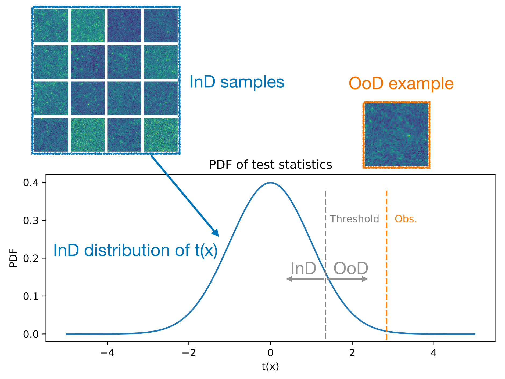

# Evaluation
***
Participants must submit their predictions to the Codabench platform using the public test data we provide. 

## Out-of-Distribution Detection Scoring Metric

Given a test sample $\boldsymbol{x}_i$, participant's model should give a continuous OoD score $t(\boldsymbol{x}_i)$ that increases monotonically with the confidence that their models predict a given sample as OoD.

The figure below illustrates that, by setting a threshold over the OoD score, samples with $t(\boldsymbol{x})$ above the threshold are classified as OoD, while those below are treated as InD. As the threshold varies, the predictions will lead to different true positive rates (TPRs, correctly identifying OoD samples) and false positive rates (FPRs, misclassifying InD samples as OoD). Tracing the pairs of FPR and TPR across all thresholds naturally defines the Receiver Operating Characteristic (ROC) curve. The OoD score $t(\boldsymbol{x})$ could be, for example, any test statistic increasing monotonically with the OoD likelihood, or the negative $p$-value defined from the test statistics of the training data and test data. 

 

 

*
Figure adapted from Diao et al. [<ins>2505.00632</ins>](https://arxiv.org/abs/2505.00632)
*

In this competition, the model's OoD detection performance will be evaluated by the mean values of the ROC curve over $N=100$ logarithmically spaced FPRs between $0.001$ and $0.05$; that is,
    $$
        \text{Leaderboard score} \equiv \frac{1}{N}\sum_{i}^{N} \text{TPR}(\text{FPR}_i)  ~.
    $$
This metric is approximately proportional to the area under the ROC curve over the given FPR range in logarithmic scale. 

The FPR range $[0.001,0.05]$ is chosen to match the regime of practical interest for scientific anomaly detection, where the FPR corresponds to the Type-I error rate (significance level $\alpha$). The interval spans thresholds from weak evidence ($\alpha \sim 0.05$) to stringent detection ($\alpha \sim 0.001$, approximately $3\sigma$). Focusing on this range therefore rewards models with high detection power under practically meaningful false-positive constraints, while logarithmic spacing emphasizes performance at the smallest FPRs.

#### ⚠️ Important requirement:
As the goal of this competition is to facilitate the development of OoD detection methods that are applicable to realistic observational scenarios—where test data may be extremely limited—we require that submitted methods are capable of identifying OoD samples even when only a single test instance is available. **Any OoD detection approaches that rely on aggregating information across multiple test samples will not be considered for the final rankings or prize eligibility**.

The organizers reserve the right to evaluate submissions to verify compliance with this requirement and to disqualify methods that implicitly or explicitly exploit multiple test instances. See `Terms` tab for more information about the competition rules and final evaluation.
