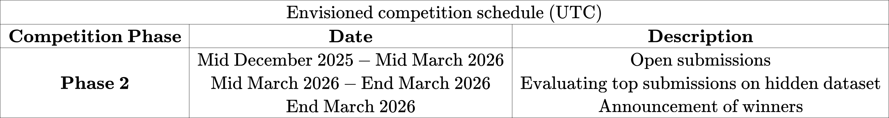

# FAIR Universe - Weak Lensing ML Uncertainty Challenge (Phase 2)
*** 
This **Phase 2** of Weak Lensing Machine Learning Uncertainty Challenge explores ***out-of-distribution (OoD) detection*** AI techniques for **Weak Gravitational Lensing Cosmology**.

🏗️ The competition will start soon! Some information remain tentative, but **you can register now through your affiliation/company email address, and you will receive a notification when it officially start!**   <!-- ##To change -->
<!-- 🚀 **Phase 2** of the competition HAS STARTED!  
🚩 To enter the competition, please register through your **affiliation/institutional email**.  -->
***

## Introduction
The large-scale structure of the universe—the cosmic web of galaxies, galaxy clusters, and dark matter spanning hundreds of millions of light-years—encodes essential information about the composition, evolution, and fundamental laws governing the cosmos. However, the majority of matter in the universe is dark matter, which does not interact with light and can only be observed indirectly through its gravitational effects. According to Einstein’s theory of general relativity, the gravitational field of this large-scale structure bends the path of light traveling through the universe. **Weak gravitational lensing** refers to the subtle, coherent distortions in the observed shapes of distant galaxies caused by the deflection of light as it traverses the inhomogeneous matter distribution of the universe. By statistically analyzing these distortions across large regions of the sky, weak lensing provides a powerful probe of the matter distribution and the underlying cosmological model that governs the expansion of the universe.

Traditional analysis based on two-point correlation functions can only capture limited amount of information from the weak lensing data (2D fields similar to images). To fully exploit the non-Gaussian features present in the cosmic web, higher-order statistics and modern machine learning (ML) methods have become increasingly important. These approaches, including deep learning and simulation-based inference, have been shown to extract significant more information in weak lensing maps than traditional techniques. However, different analyses assume different dataset setups and lead to different results, making it hard to directly compare with existing approaches. Furthermore, most (if not all) of these methods rely heavily on simulations that may not accurately represent real data due to modeling approximations and missing systematics. We can frame this problem as an **out-of-distribution (OoD) detection task**; that is, *whether or not the actual observations deviate from the simulation or forward model used to train our models?*

This competition is motivated by the need to quantify and compare the information content that different analysis methods—ranging from classical statistics to ML-based models—can extract from weak lensing maps, while also evaluating their robustness to simulation inaccuracies and observational systematic uncertaintes.

The outcomes of this competition are expected to guide the development of next-generation weak lensing analysis pipelines, foster cross-disciplinary collaboration between the astrophysics and machine learning communities, and ultimately improve the reliability of cosmological inference from current and upcoming surveys such as LSST, Euclid, and the Roman Space Telescope. By explicitly addressing simulation-model mismatch and the need to quantify systematic uncertainties, this competition emphasizes scientific robustness and interpretability, aligning with the growing emphasis on trustworthy ML in scientific domains.

## Competition Tasks: Out-of-Distribution Detection
***
Through this competition, participants will analyze a suite of carefully designed mock weak lensing convergence maps (2D fields similar to images) with known cosmological parameters, constructed to include variations in simulation fidelity and several observational systematic uncertainties. By comparing the performance and robustness of different methods in a controlled setting, the competition aims to systematically assess their ability to extract cosmological information while quantifying their sensitivity to modeling assumptions and systematics.

Participants are provided with a large training dataset to train models that learn useful cosmological features. Participants have to develop methods for **out-of-distribution (OoD) detection**, with the goal of identifying a fraction of the test data that deviates from the training distribution. 

Our training datasets incorporate all major known systematics and are constructed to be as realistic as possible. As a result, we anticipate that models developed through this competition will be directly applicable to real observational data, enabling more robust and precise cosmological measurements.

***
There are several materials regarding the FAIR Universe - Weak Lensing ML Uncertainty Challenge:

* [**<ins>Training Data / Test Data (15.5 GB)</ins>**](https://www.codabench.org/datasets/download/e270eb62-844f-48f8-a815-19d5df83a592/): 
The file includes the training data, physical labels, and the public test data for this competition.

* [**<ins>GitHub Repository</ins>**](https://github.com/FAIR-Universe/Cosmology_Challenge/tree/master): This repository hosts the code for testing submissions, as well as the starting kit notebooks ([<ins>Power Spectrum Analysis + MCMC</ins>](https://github.com/FAIR-Universe/Cosmology_Challenge/blob/master/Phase_2_Startingkit_WL_PSAnalysis.ipynb), [<ins>Convolutional Neural Network + MCMC</ins>](https://github.com/FAIR-Universe/Cosmology_Challenge/blob/master/Phase_2_Startingkit_WL_CNN_MCMC.ipynb), and [<ins>Autoencoder</ins>](https://github.com/FAIR-Universe/Cosmology_Challenge/blob/master/Phase_2_Startingkit_WL_AE.ipynb)). The starting kits are also available over the `Starting Kit` tab of this competition or on Google Colab.

## How to join this competition?
***
- Login or Create Account on [<ins>Codabench</ins>](https://www.codabench.org/) 

   🚩 **Please register through your affiliation/company email address.** Contact us if you have any problems with this.

  🏗️  **The competition will start soon. Registering now so that you will be notified when the competition start.**     <!-- ##To change -->

- Go to the `Starting Kit` tab 
- Download the `Dummy Sample Submission`
- Go to the `My Submissions` tab
- Register in the Competition
- Submit the downloaded file

## Submissions
***
This competition allows only result submissions. Participants can submit a result submission as instructed in the `Starting Kit` tab.

## Timeline
***
Available soon. <!-- ##To change -->
<!--  -->

## Credits
***
#### Institute for Advanced Study
- Biwei Dai 

#### Lawrence Berkeley National Laboratory
- Wahid Bhimji
- Paolo Calafiura
- Po-Wen Chang
- Steven Farrell
- Chris Harris

#### University of California, Berkeley
- Uroš Seljak

#### Stanford University / SLAC National Accelerator Laboratory
- Benjamin Nachman

#### University of Washington
- Yuan-Tang Chou
- Yulei Zhang

#### ChaLearn
- Isabelle Guyon
- Ihsan Ullah

#### Université Paris-Saclay
- Ragansu Chakkappai
- David Rousseau

#### University of Toronto
- Ibrahim Elsharkawy

## Contact
***
Visit our website: <ins>https://fair-universe.lbl.gov/</ins>

Email: <ins>fair-universe@lbl.gov</ins>

Updates will be announced through the [<ins>Codabench forum</ins>](https://www.codabench.org/forums/10738/).