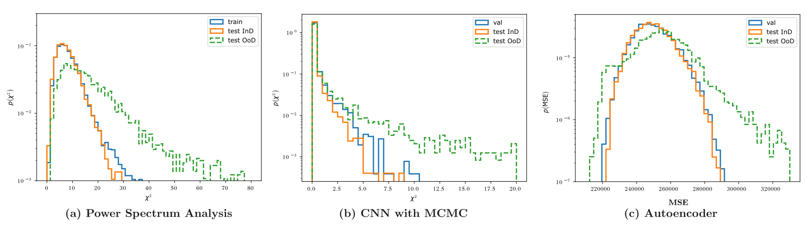

# Starting Kit and Sample Submission
***

## Baseline Methods

1. **Chi-squared distributions from the Phase-1 baseline methods**

    With the baseline MCMC methods of Phase 1 (see [<ins>here</ins>](https://www.codabench.org/competitions/8934/)), we assess the goodness-of-fit of the test sample $i$ using the $\chi^2$ statistic
    $$
        \chi_i^2 = [\boldsymbol{d}_i-\mu(\hat{\boldsymbol{\Theta}}_i)]^T {\rm Cov}^{-1}(\hat{\boldsymbol{\Theta}}_i)[\boldsymbol{d}_i-\mu(\hat{\boldsymbol{\Theta}}_i)]~,    
    $$
    where $\mu(\hat{\boldsymbol{\Theta}}_i)$ and ${\rm Cov}(\hat{\boldsymbol{\Theta}_i})$ are the mean and covariance matrix of the summary statistics estimated at the best-fit parameters $\hat{\boldsymbol{\Theta}}_i = (\hat{\Omega}_{m,i}, \hat{S}_{8,i})$, and $\boldsymbol{d}_i$ is the summary statistic of the test sample $i$.

    We then estimate the $p$-value for the test sample $i$ using the $\chi^2$ distribution of the training set that is only composed of InD samples by computing the fraction of InD training samples whose $\chi^2$ values are smaller than the test realization
    $$
        p\text{-value}_i = \text{probability}(\chi_{\rm train~(InD)}^2 > \chi_i^2)~.
    $$
    We then take the negative $p$-value as the OoD score.

2. **Reconstruction errors with autoencoder}**

    An alternative approach to estimate the InD probability is to quantify how well the test convergence maps can be reconstructed by a neural network trained exclusively on the InD samples. We train a convolutional autoencoder (AE) on the training set, which contains only InD realizations drawn from the fiducial cosmological prior. The AE learns a low-dimensional latent representation $\boldsymbol{z}$ of each convergence map $\boldsymbol{x}$ through an encoder $\mathcal{E}_{\rm NN}^{\phi}(\boldsymbol{x})$, and reconstructs the input via a decoder $\mathcal{D}_{\rm NN}^{\phi}(\boldsymbol{z})$. The reconstructed map is given by
    $$
        \hat{\boldsymbol{x}} = \mathcal{D}_{\rm NN}^{\phi}(\boldsymbol{z} = \mathcal{E}_{\rm NN}^{\phi}(\boldsymbol{x}))~. 
    $$

    For the network architecture, we employ a convolutional autoencoder with a low-dimensional latent bottleneck to quantify the degree to which each convergence map can be faithfully reconstructed by a model trained exclusively on InD data.

    For simplicity, we train the model using a purely reconstruction-based objective. Specifically, the loss function minimizes the mean-squared reconstruction error,
    $$
        \mathcal{L}_{\rm AE} = \|\boldsymbol{x} - \hat{\boldsymbol{x}}\|^2,
    $$
    while the Kullback–Leibler regularization term normally used in VAEs is set to zero. As a result, the network behaves as a deterministic autoencoder during training, learning a compressed representation that preserves only the information required to reconstruct InD maps accurately.

    For each map $\boldsymbol{x}_i$, the autoencoder produces a reconstruction $\hat{\boldsymbol{x}}_i$, and the reconstruction error is calculated. The distribution of reconstruction errors obtained from the training set provides an empirical reference for InD data. The test samples that yield significantly large or small reconstruction errors relative to the training distribution are more likely to be OoD realizations.


The figure below shows the $\chi^2$ distributions from the power spectrum analysis and the CNN MCMC method, as well as the distribution of reconstruction errors from the autoencoder. 

<center>
 
</center>

<center>*Figure: A comparison between all baseline methods for the Phase-2 task. The InD and OoD samples in the test data can be partially distinguished.*</center>


***
### Starting Kits
We have prepared starting kits based on the baseline methods above to help participants get started with the competition, understand the data, and prepare submissions for Codabench. 
You can check the starting kit notebooks on our GitHub repository or through the Google Colab below:

1. [<ins>**OoD detection with Power Spectrum Analysis + MCMC**</ins>](https://github.com/FAIR-Universe/Cosmology_Challenge/blob/master/Phase_2_Startingkit_WL_PSAnalysis.ipynb) 

    [](https://colab.research.google.com/github/FAIR-Universe/Cosmology_Challenge/blob/master/Phase_2_Startingkit_WL_PSAnalysis.ipynb)

2. [<ins>**OoD detection with Convolutional Neural Network + MCMC**</ins>](https://github.com/FAIR-Universe/Cosmology_Challenge/blob/master/Phase_2_Startingkit_WL_CNN_MCMC.ipynb) 

    [](https://colab.research.google.com/github/FAIR-Universe/Cosmology_Challenge/blob/master/Phase_2_Startingkit_WL_CNN_MCMC.ipynb)

3. [<ins>**OoD detection with Autoencoder**</ins>](https://github.com/FAIR-Universe/Cosmology_Challenge/blob/master/Phase_2_Startingkit_WL_AE.ipynb) 

    [](https://colab.research.google.com/github/FAIR-Universe/Cosmology_Challenge/blob/master/Phase_2_Startingkit_WL_AE.ipynb)


#### ⚠️ Note:
- To run the starting kits locally on your device, please directly clone this repository. The `input_data` directory of this repository contains a downsampled dataset that allows you to run the starting kit with minimal efforts. 
- To run the CNN and Autoencoder baseline methods locally on your device, please make sure that you have installed all required libraries and relevant dependencies. Fore more information, please check our [<ins>**conda instructions**</ins>](https://github.com/FAIR-Universe/Cosmology_Challenge/tree/master/conda).
- To fully train the baseline model and generate a submission that can be scored on our competition website, you will need to download the public training data and the test data from the `Data` tab.


### Dummy Sample Submission
Dummy sample submission is provided for you to understand what is expected as a submission. The sample submission is a zip that only contains one json file named `result.json`. This file contains a list of $10,000$ OoD scores (`float` numbers) defined by participants' methods, which must monotically increase with the confidence that a given test data is OoD.

The format looks like this:

```json
{
    "ood_scores": [
            3.5678,
            1.6782,
        ... # total 10,000 items
        ]
}
```


### ⬇️ [<ins>Dummy Sample Submission</ins>](https://www.codabench.org/datasets/download/f07c1ec8-5a6c-41c8-a139-1e433f606e9b/)